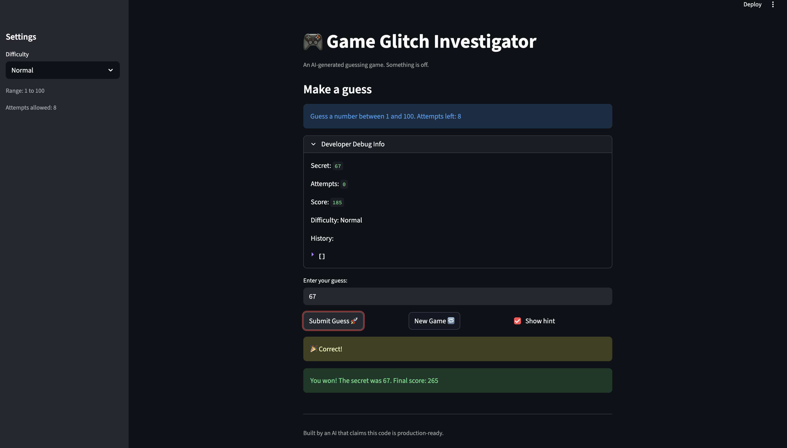

# 🎮 Game Glitch Investigator: The Impossible Guesser

## 🚨 The Situation

You asked an AI to build a simple "Number Guessing Game" using Streamlit.
It wrote the code, ran away, and now the game is unplayable. 

- You can't win.
- The hints lie to you.
- The secret number seems to have commitment issues.

## 🛠️ Setup

1. Install dependencies: `pip install -r requirements.txt`
2. Run the broken app: `python -m streamlit run app.py`

## 🕵️‍♂️ Your Mission

1. **Play the game.** Open the "Developer Debug Info" tab in the app to see the secret number. Try to win.
2. **Find the State Bug.** Why does the secret number change every time you click "Submit"? Ask ChatGPT: *"How do I keep a variable from resetting in Streamlit when I click a button?"*
3. **Fix the Logic.** The hints ("Higher/Lower") are wrong. Fix them.
4. **Refactor & Test.** - Move the logic into `logic_utils.py`.
   - Run `pytest` in your terminal.
   - Keep fixing until all tests pass!

## 📝 Document Your Experience

A number-guessing game where you pick a difficulty and try to guess a secret number before running out of attempts. Simple idea — except the AI shipped it with three bugs:

1. **The secret kept changing** — every click regenerated a new random number, so you could never actually win. Fixed by storing the secret in `st.session_state` so it survives reruns.
2. **Hints were backwards** — guessing too high told you to go higher, and vice versa. Fixed the flipped messages in `check_guess`.
3. **Couldn't start a new game after winning** — the "New Game" button reset everything *except* the game status, so the app stayed stuck on "you won." Fixed by also resetting `st.session_state.status = "playing"`.

## 📸 Demo

## 🚀 Stretch Features

- [ ] [If you choose to complete Challenge 4, insert a screenshot of your Enhanced Game UI here]
